# Lantern Detailed Function Flows

 continuation of [LANTERN_SYSTEM_ARCHITECTURE.md](LANTERN_SYSTEM_ARCHITECTURE.md).
 file starts at the media/security/function-level layers so both documents remain within Lantern's 24-Mermaid-per-page rendering cap.

---

# PART F — MEDIA / THUMBNAILS

## 27. Thumbnail pipeline

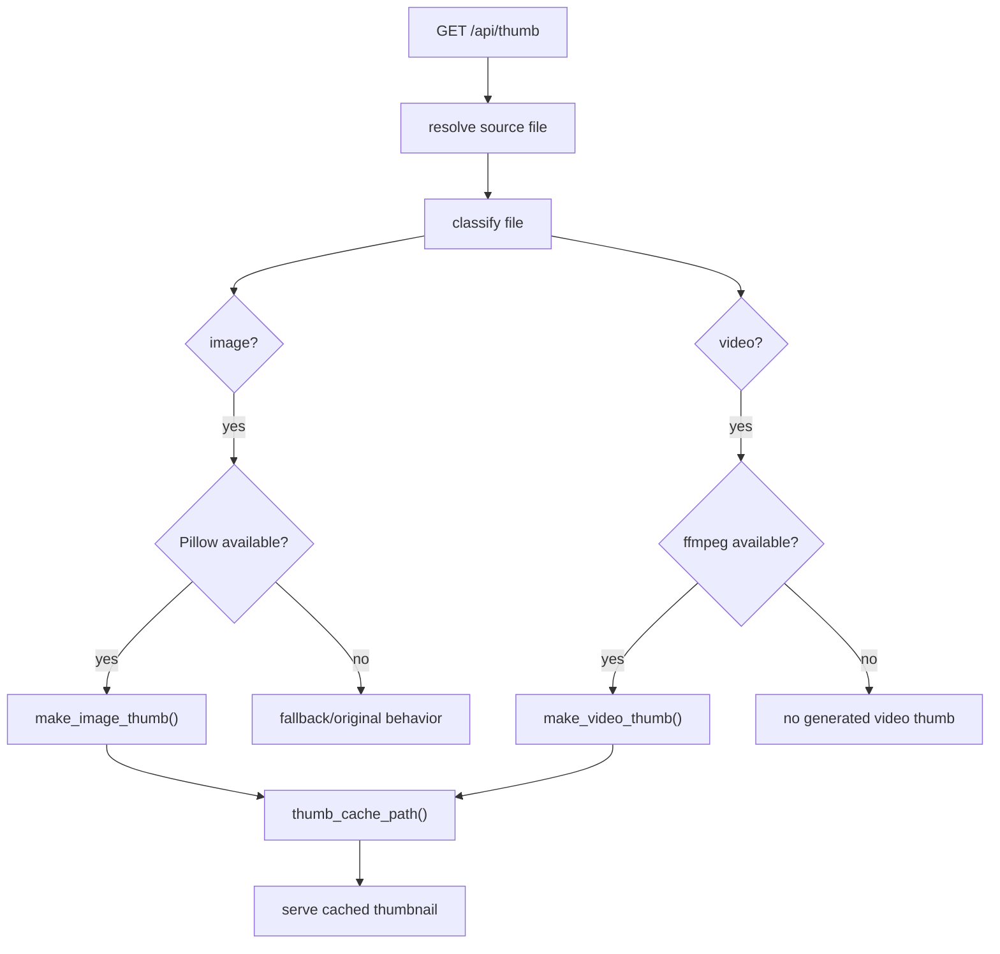

---

## 28. Video metadata / subtitle flow

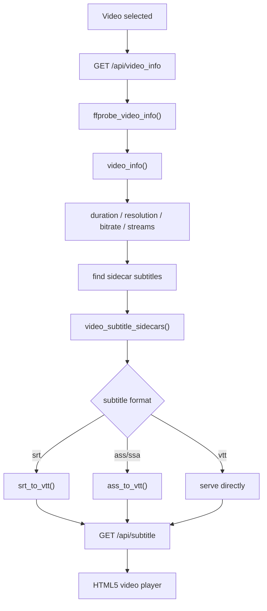

---

# PART G — SECURITY BOUNDARIES

## 29. Security control map

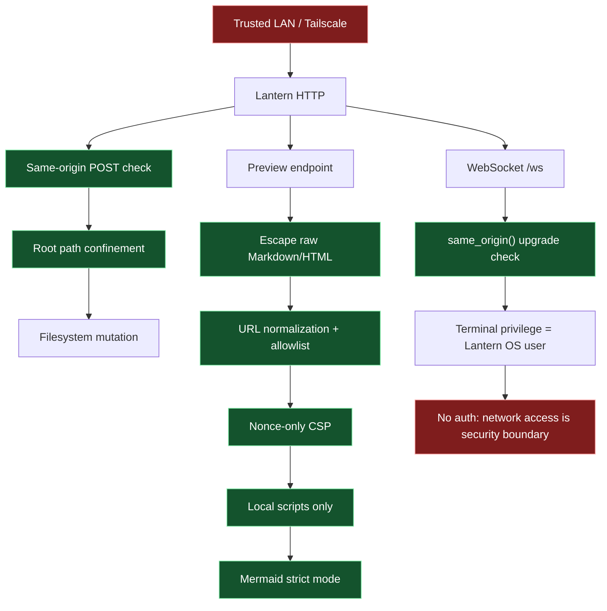

---

## 30. Preview containment model

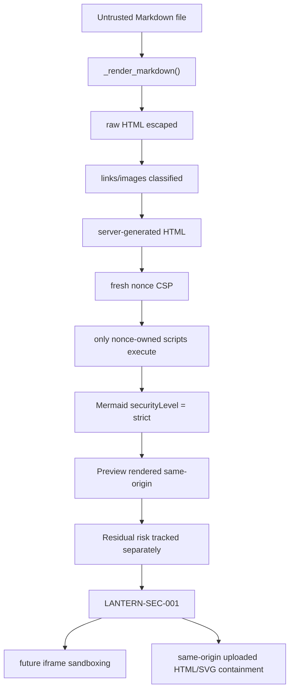

---

# PART H — FUNCTION-LEVEL MAPS

## 31. `lan_drive.py` core function groups

| Function/group | Input | Output / side effect |
| --- | --- | --- |
| `parse_args()` | CLI argv | argparse namespace |
| `build_config(args)` | CLI + YAML | resolved `AppConfig` |
| `safe_join(rel_url_path)` | user URL path | root-confined `Path` |
| `resolve_existing(rel)` | relative path | validated existing `Path` |
| `copy_item()` | source, destination, conflict mode | copied path |
| `move_item()` | source, destination, conflict mode | moved path |
| `extract_archive()` | archive, destination | extraction result |
| `list_entries_page()` | folder/search/paging/sort | paged JSON-like entries |
| `classify()` | file path | file kind |
| `video_info()` | video path | media metadata |
| `page_shell()` | title/body/current path | complete HTML page |
| `Handler.do_GET()` | HTTP GET | routed GET response |
| `Handler.do_POST()` | HTTP POST | routed mutation response |
| `main()` | process entry | initialized Lantern server |

### Function relationship

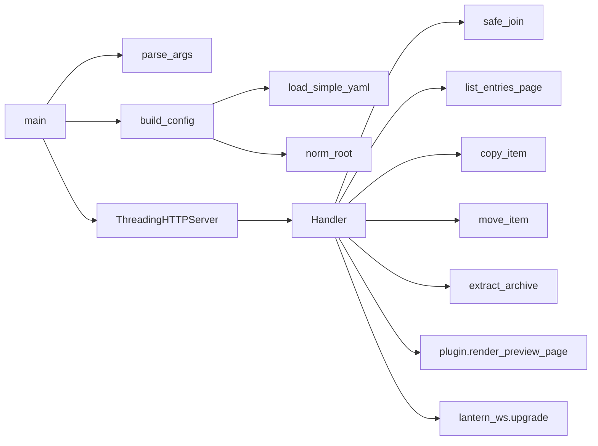

---

## 32. `plugin.py` function graph

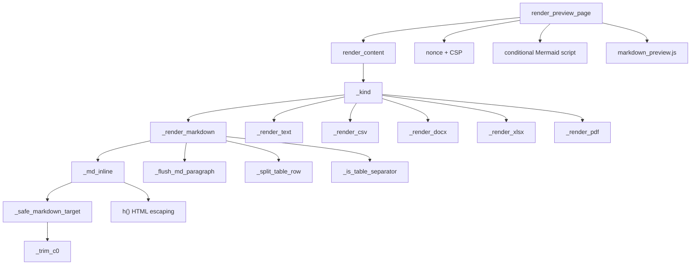

---

## 33. `TerminalManager` function graph

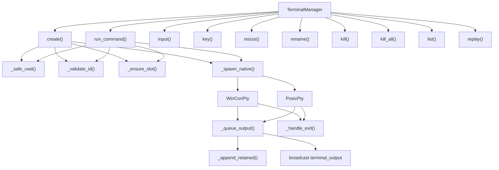

---

## 34. `ScmService` function graph

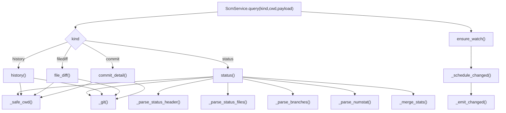

---

## 35. `static/terminal_scm.js` UI graph

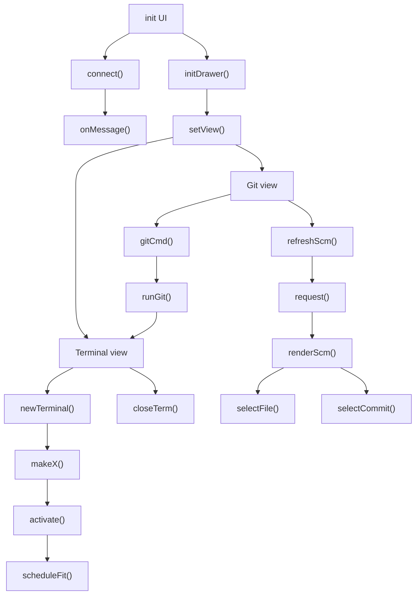

---

# PART I — END-TO-END USE CASES

## 36. Use case: open a Markdown architecture document

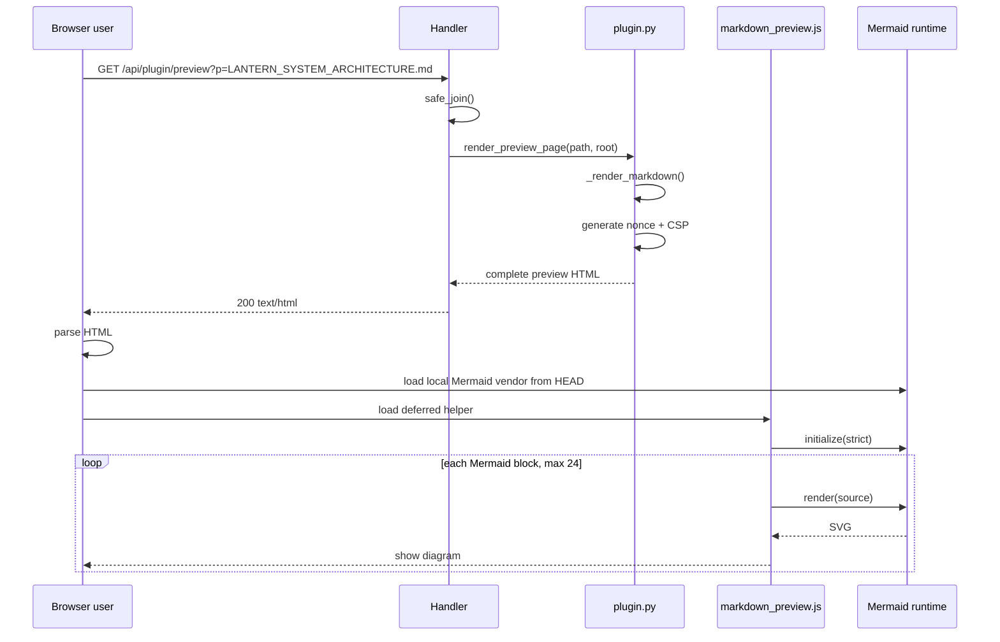

---

## 37. Use case: edit a file

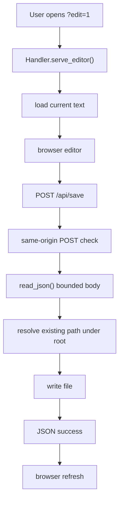

---

## 38. Use case: upload files

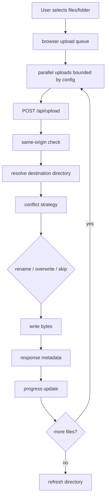

---

## 39. Use case: run a Git commit

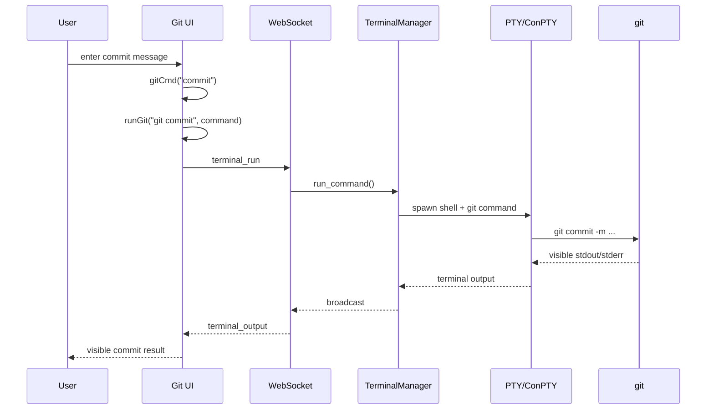

---

## 40. Use case: browser reconnect while terminal survives

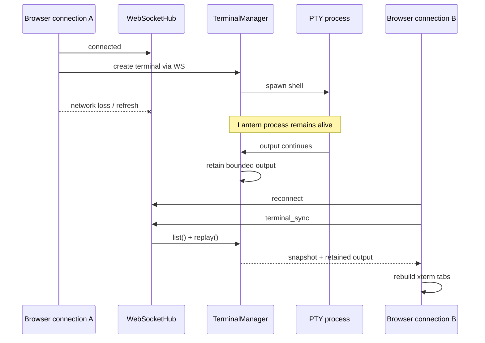

---

# PART J — DATA AND STATE OWNERSHIP

## 41. State ownership diagram

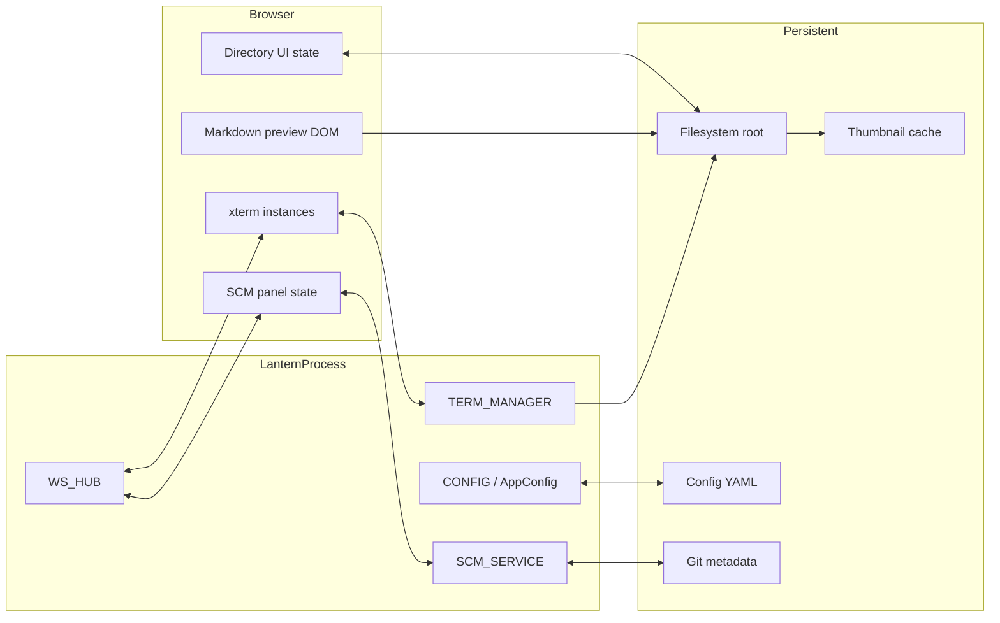

---

# PART K — TEST ARCHITECTURE

## 42. Test coverage map

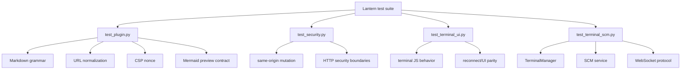

---

# PART L — OPERATIONAL MODEL

## 43. Deployment decision flow

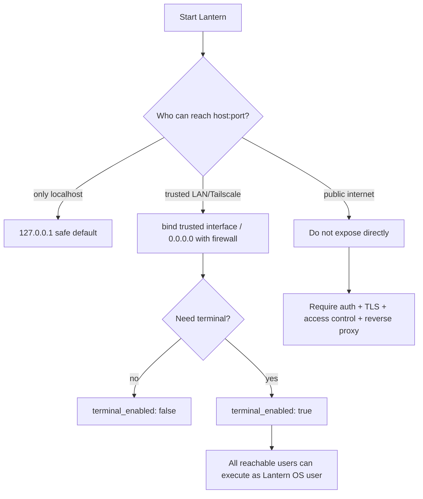

---

# PART M — FUNCTION INDEX

## 44. HTTP Handler API index

### GET

- `/ws` → WebSocket upgrade
- `/static/*` → static application assets
- `/api/info` → runtime/config information
- `/api/config` → current mutable UI config
- `/api/list` → directory listing/search/paging
- `/api/thumb` → image/video thumbnail
- `/api/folder_preview` → folder preview metadata
- `/api/video_info` → video metadata
- `/api/subtitle` → subtitle conversion/serving
- `/api/plugin/info` → plugin capability metadata
- `/api/plugin/preview` and `/api/preview` → rich document preview
- arbitrary directory → file browser page
- arbitrary file → file/media serving
- arbitrary file with `?edit=1` → editor
- arbitrary file with `?download=1` → attachment download

### POST

- `/api/upload`
- `/api/save`
- `/api/mkdir`
- `/api/newfile`
- `/api/rename`
- `/api/copy`
- `/api/move`
- `/api/duplicate`
- `/api/batch_rename`
- `/api/extract`
- `/api/delete`
- `/api/archive`
- `/api/zip`
- `/api/config`
- `/api/plugin/extensions`

---

## 45. WebSocket message index

| Type | Server action | Typical result |
| --- | --- | --- |
| `terminal_sync` | `terminal.list() + terminal.replay()` | `terminal_snapshot` |
| `terminal_create` | `TerminalManager.create()` | terminal created/broadcast |
| `terminal_run` | `TerminalManager.run_command()` | command PTY |
| `terminal_input` | `TerminalManager.input()` | bytes to PTY |
| `terminal_key` | `TerminalManager.key()` | encoded special key |
| `terminal_resize` | `TerminalManager.resize()` | PTY resize |
| `terminal_rename` | `TerminalManager.rename()` | title update |
| `terminal_kill` | `TerminalManager.kill()` | terminal exit |
| `scm_status` | `ScmService.query("status")` | `scm_data` |
| `scm_history` | `ScmService.query("history")` | `scm_data` |
| `scm_filediff` | `ScmService.query("filediff")` | `scm_data` |
| `scm_commit` | `ScmService.query("commit")` | `scm_data` |

---

# PART N — HIGH-LEVEL DEPENDENCY GRAPH

## 46. Python/JS dependency graph

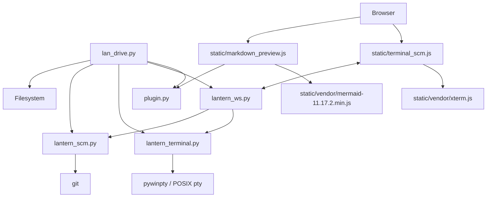

---

# PART O — WHAT LANTERN IS NOT

Lantern intentionally does **not** currently provide:

- built-in authentication;
- public-internet hardening by itself;
- terminal survival across Lantern process restart;
- a hidden server-side Git mutation engine;
- a server-side PDF rendering service;
- a Mermaid CDN dependency;
- unrestricted Markdown raw HTML execution.

---

# PART P — CURRENT KNOWN FOLLOW-UP

## 47. Preview containment follow-up

The current Markdown/Mermaid lane is released with an explicit owner-approved residual-risk sign-off.

Tracked follow-up:

- `LANTERN-SEC-001`
  - preview iframe sandboxing;
  - containment of same-origin uploaded HTML/SVG serving.

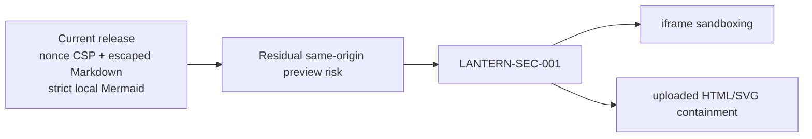

---

# PART Q — QUICK TRACE GUIDE

When debugging a feature, follow this owner map:

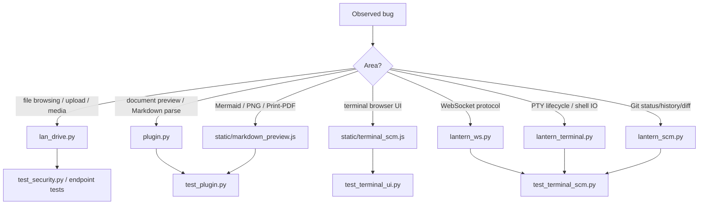

---

## 48. Architectural summary

Lantern is deliberately structured around a small set of owners:

1. **`lan_drive.py` owns HTTP and filesystem behavior.**
2. **`plugin.py` owns safe document-to-preview HTML generation.**
3. **`markdown_preview.js` owns browser-only Mermaid/export behavior.**
4. **`lantern_ws.py` owns the browser/server realtime protocol.**
5. **`lantern_terminal.py` owns native terminal process lifetime and replay.**
6. **`lantern_scm.py` owns read-side Git state; Git mutations stay visible in terminal tabs.**
7. **Security relies on trusted-network deployment, root confinement, same-origin checks, preview escaping/CSP, and explicit terminal enablement.**

That separation is the main reason Lantern can remain small while still providing file manager + preview + terminal + SCM functionality in one application.
