# Lantern System Architecture & Function Flows

> Source-grounded architecture document for the current Lantern repository.
>
> Scope: file manager, HTTP routing, plugin preview, Markdown/Mermaid rendering, terminal/PTY, WebSocket transport, Git/SCM, media preview, configuration, security boundaries, and lifecycle.
>
> This file is intentionally Mermaid-heavy. It doubles as a real system document and a complex Markdown/Mermaid regression fixture for Lantern itself.

---

## 1. System purpose

Lantern is a lightweight LAN/Tailscale web file manager with integrated terminal and Git tooling.

Main capabilities:

- browse, search, preview, upload, edit, download, copy, move, rename, duplicate, delete, archive, and extract files;
- stream media and generate thumbnails;
- preview Markdown, text/code, CSV/TSV, DOCX, XLSX/XLSM, and PDF;
- render local/offline Mermaid diagrams inside Markdown preview;
- export each Mermaid diagram to PNG;
- print/save Markdown preview to PDF;
- provide multiple browser terminals backed by real PTY/ConPTY;
- preserve terminal processes across browser reconnect while Lantern itself remains running;
- expose Git status, history, diff, stage/unstage, checkout, commit, pull, and push;
- remain dependency-light and framework-light.

---

## 2. Top-level system context

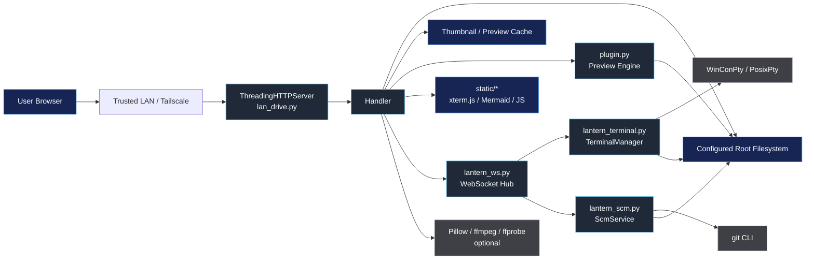

### Primary trust assumption

Lantern has no built-in authentication. The intended trust boundary is the private LAN/Tailscale network plus host firewall/reverse-proxy controls.

---

## 3. Repository module map

| Module | Primary responsibility | Important owners |
| --- | --- | --- |
| `lan_drive.py` | HTTP server, file manager UI/API, media serving, configuration | `AppConfig`, `Handler`, `main` |
| `plugin.py` | document/Markdown preview and preview-page CSP | `render_content`, `_render_markdown`, `render_preview_page` |
| `static/markdown_preview.js` | Mermaid render, PNG export, Print/PDF UI | `loadMermaid`, `initializeMermaid`, `renderOne`, `exportPng` |
| `lantern_ws.py` | WebSocket framing, connection hub, command dispatch | `WebSocketPeer`, `WebSocketHub`, `upgrade`, `dispatch` |
| `lantern_terminal.py` | PTY/ConPTY session ownership and retained output | `NativePty`, `WinConPty`, `PosixPty`, `TerminalManager` |
| `static/terminal_scm.js` | xterm UI, reconnect, terminal tabs, Git panel | `connect`, `makeX`, `newTerminal`, `refreshScm`, `runGit` |
| `lantern_scm.py` | read-side Git queries and metadata watching | `ScmService` |
| `test_plugin.py` | preview/CSP/Markdown security contracts | `MarkdownPreviewTests`, `HtmlAudit` |
| `test_terminal_ui.py` | browser terminal behavior contracts | `TerminalUiParityTests` |
| `test_terminal_scm.py` | terminal manager, SCM, WebSocket protocol | parity test classes |
| `test_security.py` | HTTP mutation security | `HttpMutationSecurityTests` |

---

# PART A — APPLICATION LIFECYCLE

## 4. Startup lifecycle — `main()`

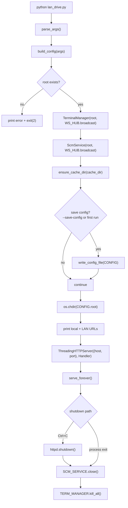

### Startup invariants

- the configured root must exist;
- terminal and SCM managers are created once per Lantern process;
- terminal persistence is process-lifetime persistence, not process-restart persistence;
- HTTP requests are handled by a threaded server;
- shutdown closes SCM watchers and all terminal processes.

---

## 5. Configuration resolution flow

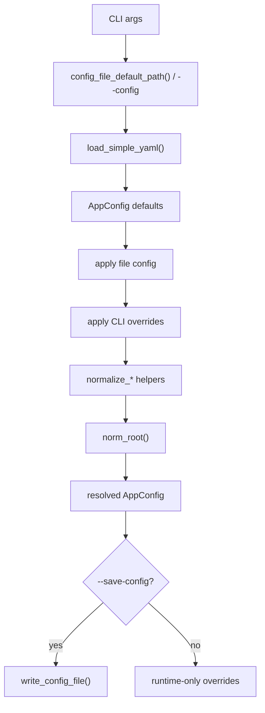

Important normalization functions:

- `normalize_sort`
- `normalize_view`
- `normalize_page_limit`
- `normalize_fit`
- `normalize_animation`
- `normalize_conflict`
- `normalize_recursive_depth`

---

# PART B — HTTP AND FILE MANAGER

## 6. GET request router — `Handler.do_GET()`

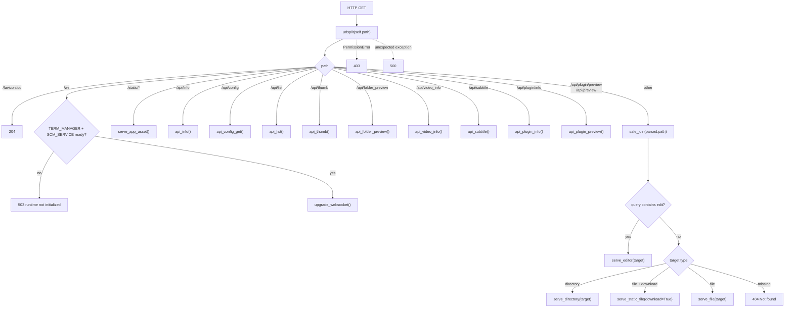

---

## 7. POST mutation router — `Handler.do_POST()`

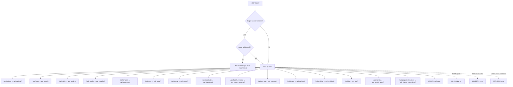

---

## 8. Path confinement and mutation safety

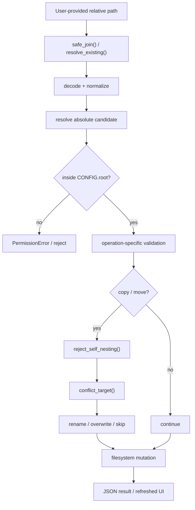

Core helpers:

- `safe_join`
- `ensure_under_root`
- `resolve_existing`
- `resolve_destination_dir`
- `reject_self_nesting`
- `conflict_target`
- `unique_path`

---

## 9. Directory listing and search pipeline

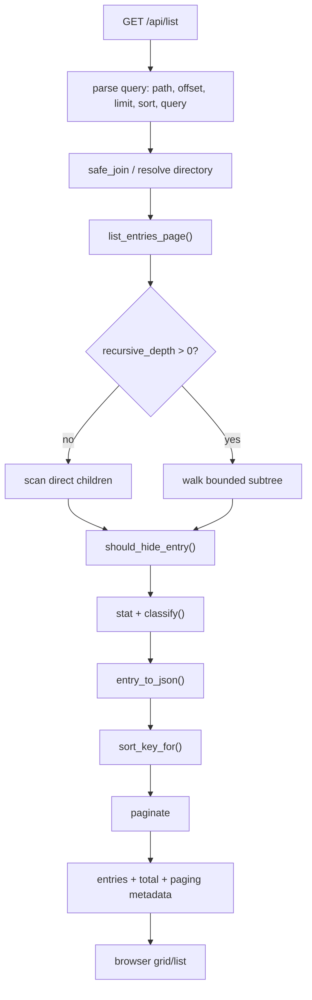

---

## 10. File operation family

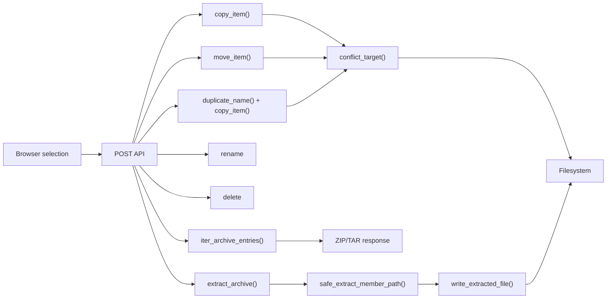

Archive extraction specifically confines every extracted member beneath the selected destination.

---

# PART C — PREVIEW AND MARKDOWN

## 11. Generic preview dispatch — `render_content()`

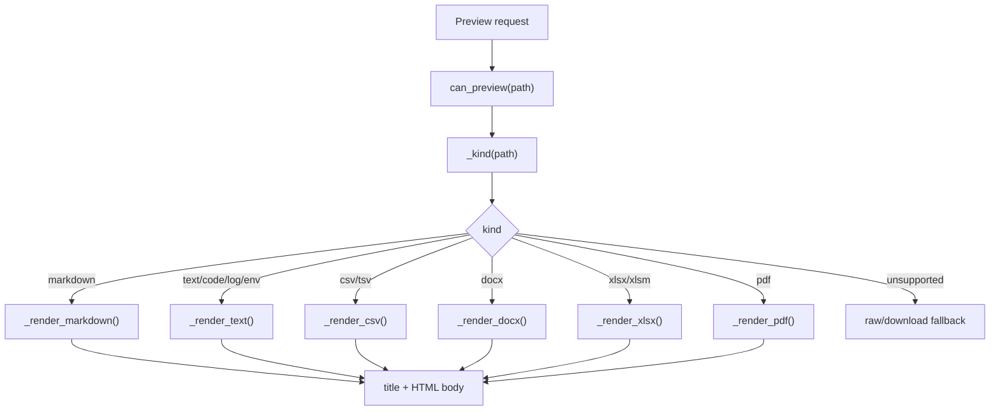

---

## 12. Markdown parser flow — `_render_markdown()`

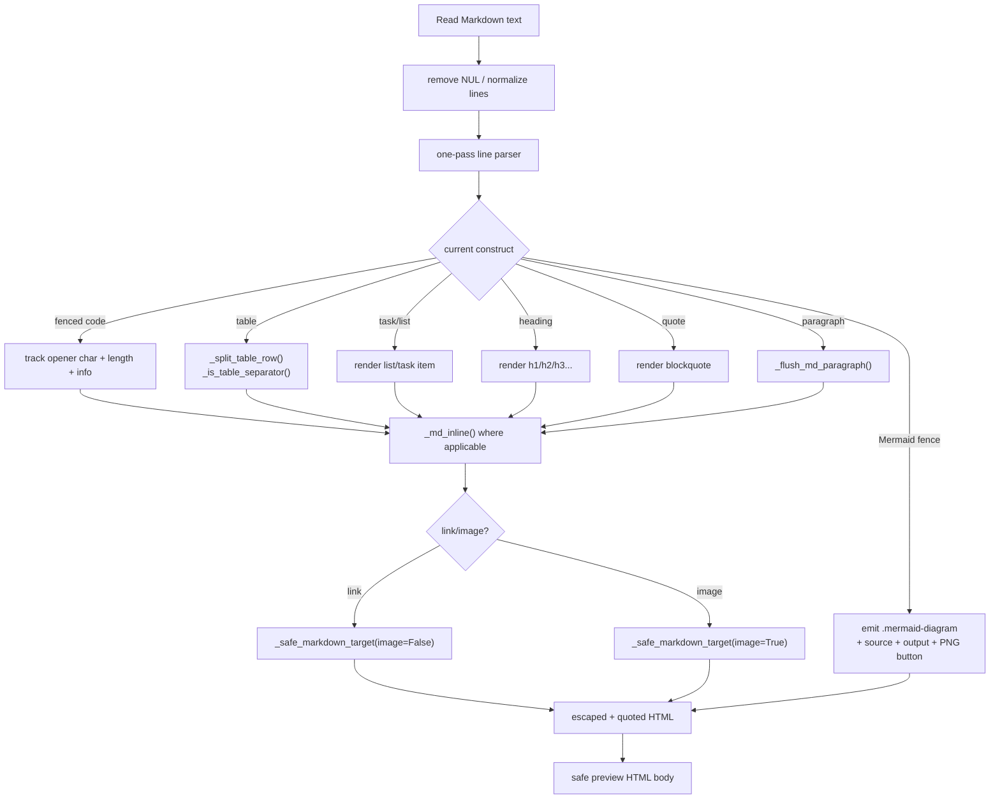

---

## 13. Markdown link/image security path — `_safe_markdown_target()`

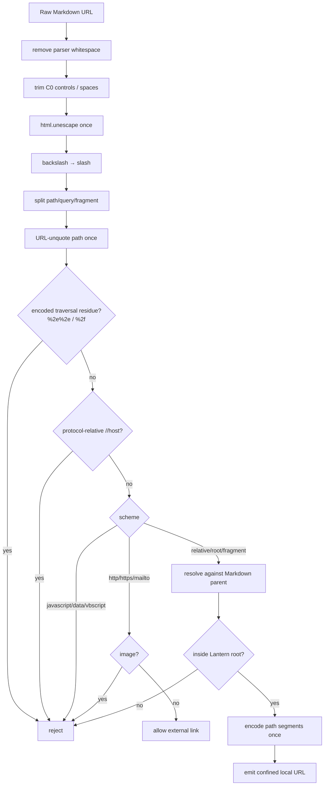

---

## 14. Preview page + CSP construction — `render_preview_page()`

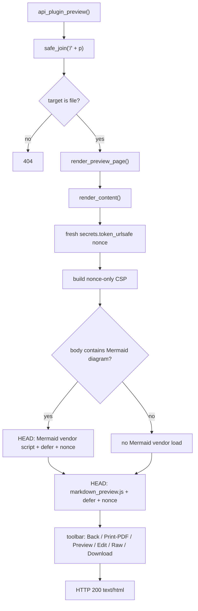

Current CSP:

```text
default-src 'none';
script-src 'nonce-{random}';
style-src 'self' 'unsafe-inline';
img-src 'self' data: blob:;
connect-src 'none';
base-uri 'none';
object-src 'none';
form-action 'none'
```

---

## 15. Mermaid render lifecycle — `static/markdown_preview.js`

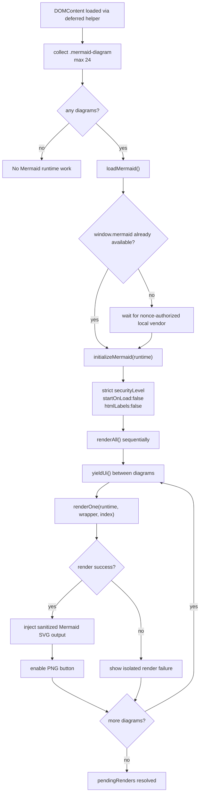

Mermaid is fully local/offline; no CDN is required.

---

## 16. Mermaid PNG export — `exportPng()`

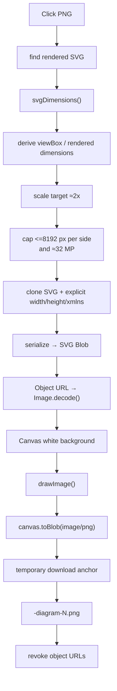

---

## 17. Whole Markdown → PDF

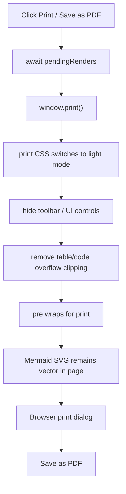

This uses the browser's print/PDF path rather than introducing a server-side PDF engine.

---

# PART D — TERMINAL

## 18. Terminal end-to-end data path

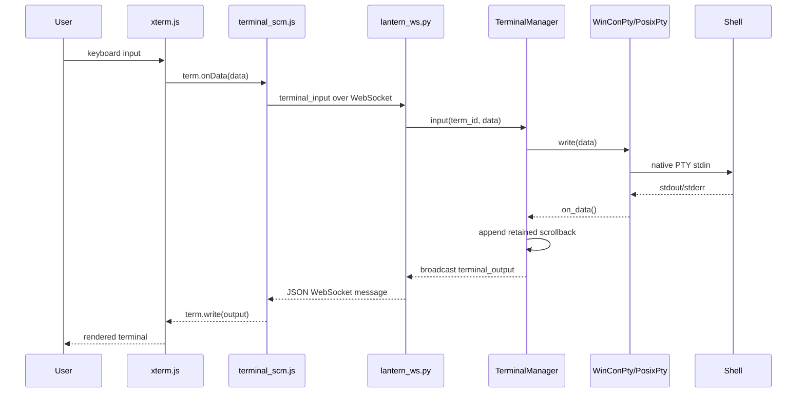

---

## 19. Browser terminal creation — `newTerminal()`

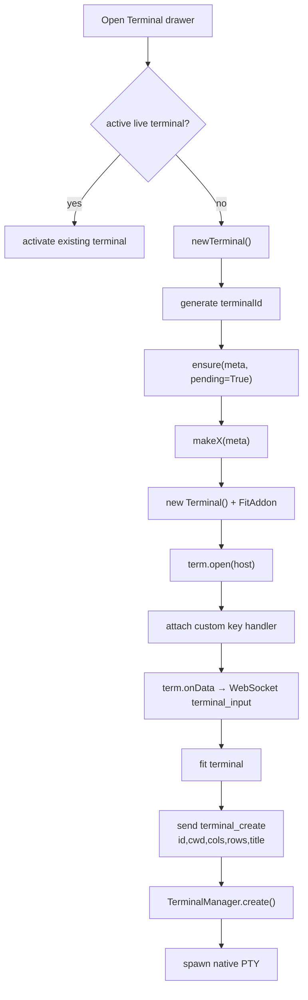

---

## 20. Native PTY selection — `TerminalManager._spawn_native()`

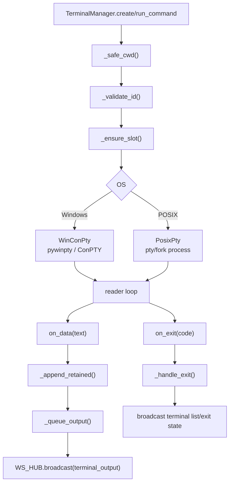

---

## 21. Terminal lifecycle state machine

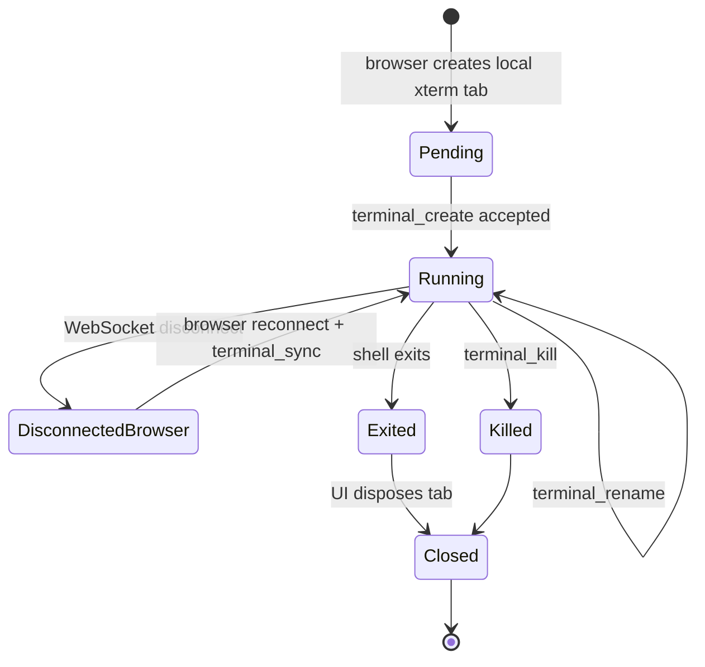

Key property: browser reconnect does not kill the PTY. Lantern process shutdown does.

---

## 22. Browser reconnect and replay

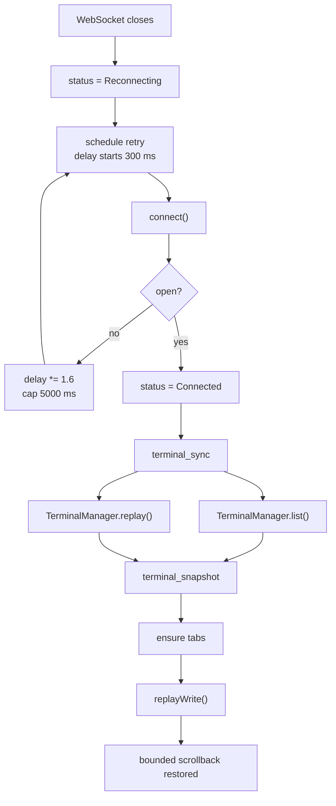

---

## 23. WebSocket dispatch — `dispatch()`

```mermaid
flowchart TD
    A["decoded JSON message"] --> B["type"]
    B --> TS["terminal_sync"]
    TS --> SNAP["terminal_snapshot(list + replay)"]

    B --> TC["terminal_create"]
    TC --> CREATE["TerminalManager.create()"]

    B --> TR["terminal_run"]
    TR --> RUN["TerminalManager.run_command()"]

    B --> TI["terminal_input"]
    TI --> INPUT["TerminalManager.input()"]

    B --> TK["terminal_key"]
    TK --> KEY["TerminalManager.key()"]

    B --> TZ["terminal_resize"]
    TZ --> RESIZE["TerminalManager.resize()"]

    B --> TN["terminal_rename"]
    TN --> RENAME["TerminalManager.rename()"]

    B --> TKL["terminal_kill"]
    TKL --> KILL["TerminalManager.kill()"]

    B --> SS["scm_status"]
    B --> SH["scm_history"]
    B --> SD["scm_filediff"]
    B --> SC["scm_commit"]

    SS --> Q["ScmService.query()"]
    SH --> Q
    SD --> Q
    SC --> Q
    Q --> REPLY["scm_data(reqId, kind, ok/data or error)"]

    B --> UNKNOWN["ValueError Unknown WebSocket message"]
```

---

# PART E — GIT / SCM

## 24. SCM read path

```mermaid
sequenceDiagram
    participant UI as Git panel
    participant JS as terminal_scm.js
    participant WS as lantern_ws.py
    participant SCM as ScmService
    participant GIT as git CLI

    UI->>JS: open Git / select tab
    JS->>WS: scm_status(reqId,cwd)
    WS->>SCM: query("status", cwd)
    SCM->>GIT: git status / branch / numstat
    GIT-->>SCM: text output
    SCM-->>WS: structured status
    WS-->>JS: scm_data(reqId)
    JS-->>UI: renderScm()

    UI->>JS: select commit
    JS->>WS: scm_commit(reqId, hash)
    WS->>SCM: commit_detail()
    SCM->>GIT: git show ...
    GIT-->>SCM: diff/details
    SCM-->>UI: via WS + render
```

---

## 25. Git write path — visible terminal by design

```mermaid
flowchart TD
    A["User Git action"] --> B{read or write?}
    B -- read --> C["request() via WebSocket"]
    C --> D["ScmService.query()"]
    D --> E["git CLI read"]
    E --> F["render SCM panel"]

    B -- write --> G["gitCmd()"]
    G --> H["build visible shell command"]
    H --> I["runGit(title, command)"]
    I --> J["terminal_run WebSocket"]
    J --> K["TerminalManager.run_command()"]
    K --> L["real PTY/ConPTY"]
    L --> M["git add/reset/commit/checkout/pull/push"]
    M --> N["visible output in terminal tab"]
    N --> O["SCM watcher detects metadata change"]
    O --> P["refresh Git panel"]
```

This design keeps Git mutations visible and auditable in a terminal rather than hiding them inside a silent API.

---

## 26. SCM watcher / refresh path

```mermaid
flowchart TD
    A["ScmService.ensure_watch(cwd)"] --> B["resolve .git directory"]
    B --> C{"watchdog available?"}
    C -- yes --> D["filesystem metadata watcher"]
    C -- no --> E["_start_poll_fallback()"]
    D --> F["_schedule_changed()"]
    E --> G["_git_signature() changed?"]
    G -- yes --> F
    G -- no --> E
    F --> H["_emit_changed()"]
    H --> I["WS_HUB.broadcast(scm_changed)"]
    I --> J["browser refreshScm()"]
```

---

---

## Detailed function-flow appendix

For media, security, module-level function graphs, end-to-end use cases, tests, deployment, and debug ownership, continue with [LANTERN_FUNCTION_FLOWS.md](LANTERN_FUNCTION_FLOWS.md).
