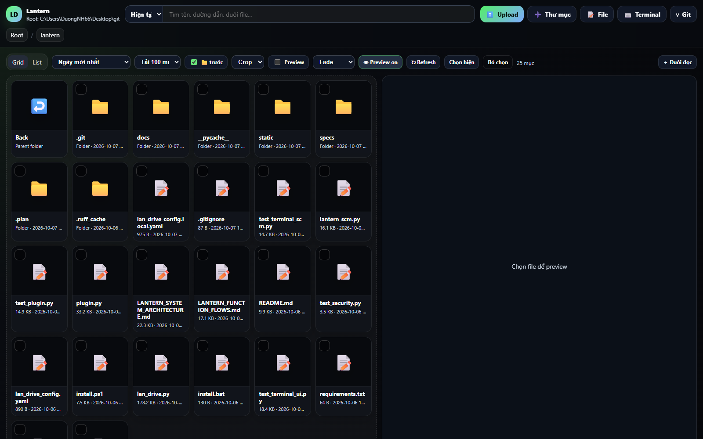
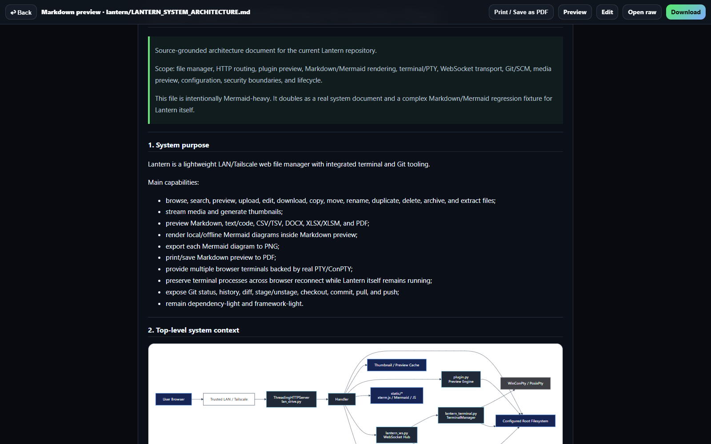
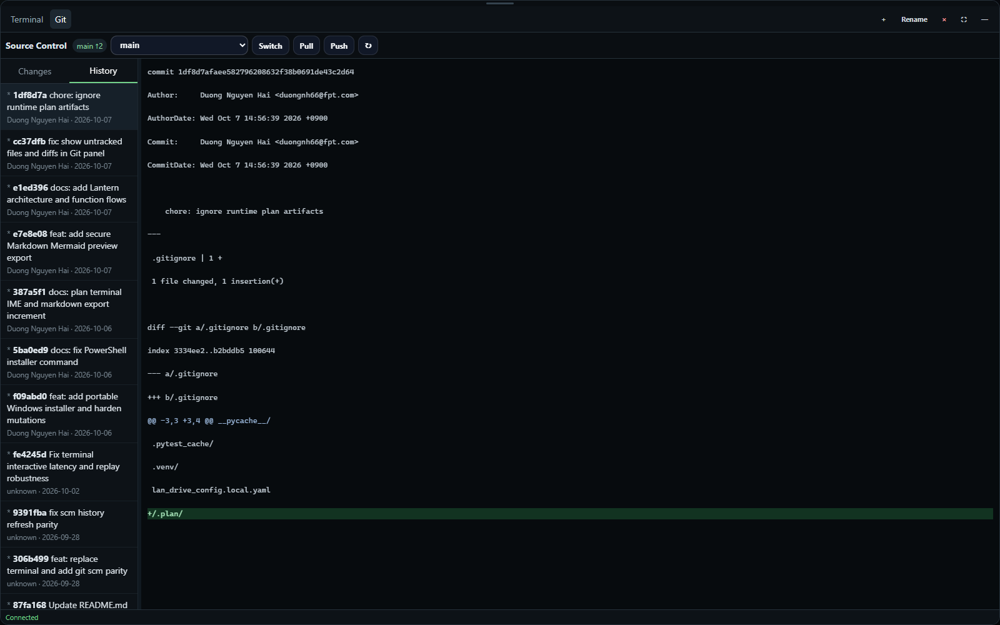
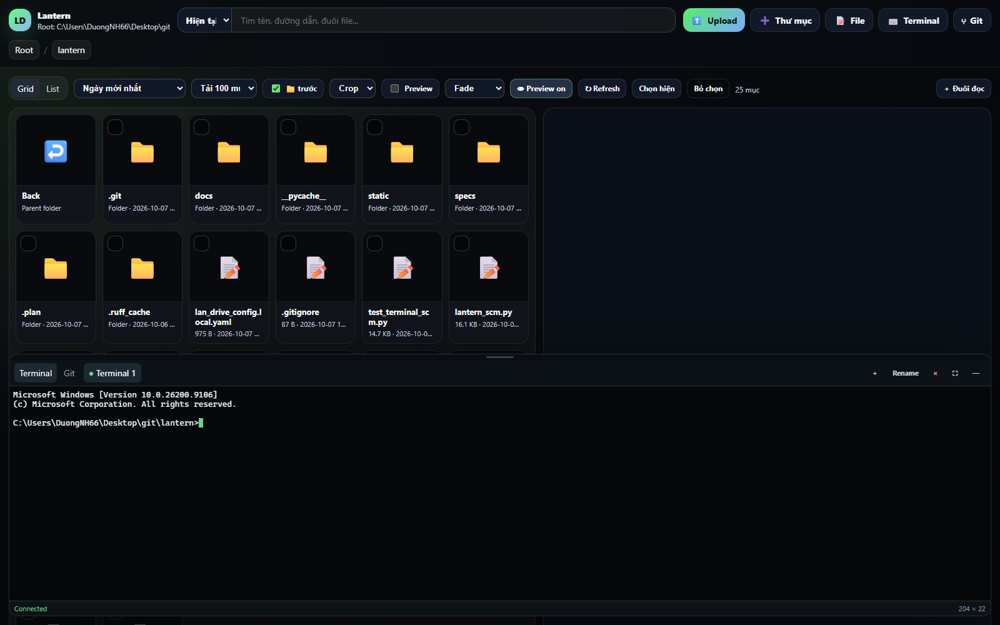

# 🏮 Lantern

**Your LAN has files. Lantern makes them behave.**

A fast, dependency-light web file manager for a trusted LAN or Tailscale network — with real terminals, Git/SCM, rich Markdown preview, Mermaid diagrams, media streaming, and enough file operations to make `scp` feel personally attacked.



> **No cloud. No database. No frontend framework pilgrimage.**
>
> Run Python, open a browser, get back to work.

---

## Why Lantern?

Lantern started as “I just need to move a few files over the LAN.”

That sentence aged poorly.

It now gives you:

| | Capability | What it means |
|---|---|---|
| 📁 | **File manager** | Browse, search, upload, edit, rename, copy, move, duplicate, delete, archive, extract, and download |
| 🖼️ | **Preview engine** | Images, text/code, CSV/TSV, DOCX, XLSX/XLSM, PDF, audio, video, Markdown |
| 🧜 | **Markdown + Mermaid** | Local/offline Mermaid rendering, flowcharts, sequence diagrams, PNG export, browser PDF export |
| 🖥️ | **Real terminal** | xterm.js over WebSocket with real PTY on Linux/macOS and ConPTY on Windows |
| 🌿 | **Git/SCM panel** | Status, diffs, history, branches, stage/unstage, commit, pull, push |
| 🎞️ | **Media** | HTTP Range video streaming, seeking, subtitles, thumbnails, automatic next-video playback |
| 📱 | **Responsive UI** | Desktop and mobile, with no database and no SPA framework required |

And yes, it still fits inside a very boring Python-shaped deployment model. This is intentional.

---

## Screenshots

### File browser


Folders, files, search, preview, copy/move/archive operations, uploads, and the comforting knowledge that the file you need is probably not in `Downloads (37)`.

### Markdown + Mermaid



Lantern renders Markdown locally, detects Mermaid fences, loads a vendored Mermaid runtime only when needed, and can export individual diagrams to PNG.

For documents with ambitions:

- tables
- fenced code blocks
- task lists
- local links and images
- Mermaid flowcharts / sequence diagrams / state diagrams
- **Mermaid → PNG**
- **Markdown page → Print / Save as PDF**

No CDN is required for Mermaid. Your architecture diagram does not need to phone home to explain itself.

### Git without leaving the page



The SCM panel handles read-side Git work directly:

- status and file diffs
- commit history
- commit detail
- local and remote branches
- stage / unstage

Mutating Git operations such as commit, checkout, pull, and push run in a **visible terminal tab**, so Lantern does not perform mysterious Git rituals behind your back.

Untracked directories are expanded into individual files, and untracked text files get a real new-file diff instead of the profoundly useful message: “No textual diff.”

### Real terminal, not terminal-flavored textarea



The browser terminal uses:

- **xterm.js + FitAddon**
- **real PTY** on Linux/macOS
- **real ConPTY via `pywinpty`** on Windows
- WebSocket transport
- multiple terminal sessions
- bounded retained scrollback
- resize / rename / kill / reconnect
- ANSI output, progress updates, CJK width handling, combining marks, and emoji

Terminal processes survive browser reconnects while the Lantern process remains alive.

They do **not** survive Lantern itself being killed. Lantern is useful; it is not necromancy.

---

## 30-second start

### Windows

From a clone:

```powershell
python lan_drive.py --root "$env:USERPROFILE" --host 127.0.0.1 --port 9999
```

Then open:

```text
http://127.0.0.1:9999
```

### Linux / macOS

```bash
python3 lan_drive.py --root ~/ --host 127.0.0.1 --port 9999
```

### Want other trusted devices to connect?

Bind a trusted interface or all interfaces:

```powershell
python lan_drive.py --root "D:\Share" --host 0.0.0.0 --port 9999
```

Then browse to the machine's **actual LAN or Tailscale IP**, not `0.0.0.0`.

### Several computers using Lantern at once

- **One server, many browsers or PCs:** terminal sessions belong to the server, not an individual tab. Each updated client subscribes to output only for its visible terminal; closing a drawer does not terminate the shared PTY. A tab running older JavaScript can still reconnect, but may see a shortened display tail until it reloads. For unusually large configured histories, updated clients also show only the last 800,000 characters in a single replay with an explicit notice. The server-retained output is unchanged in both cases.
- **Heavy document previews:** at most two DOCX/XLSX/PDF previews run at a time **per Lantern server**. Further simultaneous preview requests receive HTTP 503 (retry shortly). A preview may show a clearly labelled partial result when the document exceeds its parsing budget.
- **Several independent Lantern servers over the same network share/NAS:** each server has **its own** terminals, preview limits, and caches. Accessing the same directory does not synchronize terminal sessions or enforce global preview quotas. Concurrent file writes and Git activity still require separate coordination; don't treat the shared filesystem as a distributed transaction manager.

These are concurrency limits within one Lantern process, not an overall per-LAN bandwidth limit.

---

## One-command Windows install

On a clean Windows machine:

```powershell
$p=Join-Path $env:TEMP 'lantern-install.ps1'; Invoke-WebRequest -UseBasicParsing 'https://raw.githubusercontent.com/Hiroshimeow/lantern/main/install.ps1' -OutFile $p; & $p
```

The installer:

1. finds or installs `uv`;
2. downloads Lantern;
3. prepares a managed Python 3.12 environment;
4. installs runtime requirements;
5. writes a machine-local config;
6. validates the installation;
7. starts Lantern unless `-NoStart` is used.

Safe installer defaults:

- bind: `127.0.0.1`
- root: `%USERPROFILE%`
- terminal: **disabled**
- port: `9999`

Common variants:

```powershell
# Share one folder
.\install.bat -Root "D:\Share"

# Listen on a specific trusted LAN/Tailscale address
.\install.bat -Root "D:\Share" -HostAddress "100.x.y.z"

# Listen on every interface
.\install.bat -Root "D:\Share" -BindAll

# Enable browser terminal
.\install.bat -Root "D:\Share" -BindAll -EnableTerminal

# Install/update without starting
.\install.bat -NoStart
```

Installed launcher:

```text
%LOCALAPPDATA%\Lantern\Run-Lantern.bat
```

To uninstall: stop Lantern and remove `%LOCALAPPDATA%\Lantern`.

Elegant? Debatable. Predictable? Yes.

---

## ⚠️ Security model: read this before `-BindAll`

Lantern has **no built-in authentication**.

If someone can reach Lantern, they may be able to access the exposed filesystem. If the browser terminal is enabled, they may also execute commands as the OS user running Lantern.

Use Lantern only on a **trusted LAN or private Tailscale network**, or put proper authentication/TLS/access control in front of it.

Recommended:

- expose the smallest useful `root`;
- keep `terminal_enabled: false` unless needed;
- restrict host firewall rules;
- run as a normal user, not Administrator/root;
- do **not** expose Lantern directly to the public internet.

The Markdown preview lane adds same-origin checks, path confinement, HTML escaping, URL filtering, nonce-only script CSP, and strict local Mermaid rendering. A follow-up hardening item remains tracked for preview iframe sandboxing and same-origin uploaded HTML/SVG containment.

Security is not improved by saying “but nobody knows the port.”

---

## Markdown / Mermaid details

A fenced Mermaid block:

````markdown
```mermaid
flowchart LR
    Idea --> Code
    Code --> Test
    Test --> Ship
    Ship --> "Definitely no bug reports"
```
````

Lantern detects Mermaid blocks server-side and conditionally adds the local Mermaid bundle to the preview page.

The browser then renders diagrams sequentially and exposes a PNG export button for each rendered diagram.

### Architecture docs included in this repository

If you want a realistic stress test instead of a three-box demo:

- [LANTERN_SYSTEM_ARCHITECTURE.md](LANTERN_SYSTEM_ARCHITECTURE.md) — **24 Mermaid diagrams**
- [LANTERN_FUNCTION_FLOWS.md](LANTERN_FUNCTION_FLOWS.md) — **20 Mermaid diagrams**

Together they document Lantern's HTTP routing, filesystem operations, preview flow, terminal lifecycle, WebSocket protocol, Git/SCM, media path, security boundaries, testing, and module-level function ownership.

That is also a convenient way to test whether the Mermaid renderer regrets its career choices.

---

## File manager features

Lantern supports:

- grid and list views
- breadcrumbs
- quick and recursive search
- sorting by name, time, size, type, or extension
- show/hide hidden files
- multi-file and folder upload
- upload progress and conflict handling
- create folder / create text file
- browser text/code editor
- rename / copy / move / duplicate / delete
- archive and extract
- multi-item streamed ZIP download
- direct share-link copy
- image thumbnails
- video thumbnails with optional `ffmpeg`
- video streaming with HTTP Range
- subtitle discovery and conversion
- folder previews

In short: most operations people open Explorer for, plus fewer modal dialogs asking whether you are *really sure* the file named `final_v7_REAL_final.md` should move.

---

## Git / SCM

The Git view includes:

- branch + upstream state
- ahead / behind counts
- local and remote branch selector
- changed files
- staged / unstaged state
- untracked file expansion
- textual diffs for tracked and untracked text files
- commit history and commit detail
- stage / unstage
- commit / commit all
- checkout
- pull
- push

Read operations run through `lantern_scm.py`.

Write operations intentionally run through a real terminal session so command output remains visible.

---

## Terminal controls

Toggle the terminal:

```text
Ctrl + `
```

Useful shortcuts:

| Shortcut | Action |
|---|---|
| `Ctrl+C` | Copy selected text; send interrupt when nothing is selected |
| `Ctrl+V` | Browser-native paste into xterm |
| `Ctrl+L` | Clear through the active shell/readline binding |
| `Ctrl+D` | Send EOF |
| `Alt+Enter` | Toggle terminal fullscreen |
| `Esc` | Leave terminal fullscreen |

Mobile gets dedicated Ctrl / Alt / Esc / Tab / arrows / Backspace helpers.

---

## Configuration

Use a YAML config:

```bash
python lan_drive.py --config lan_drive_config.yaml
```

Example:

```yaml
root: "."
host: "127.0.0.1"
port: 9999
title: "Lantern"
cache_dir: ""

show_hidden: false
show_system: false
default_sort: "name-asc"
default_view: "grid"
page_limit: 100
folders_first: true

terminal_enabled: false
terminal_max_sessions: 16
terminal_max_buffer_chars: 204800
terminal_start_height_px: 380

thumb_fit: "cover"
folder_preview_enabled: true
upload_parallel: 3
upload_conflict: "ask"
```

Machine-specific configuration should live in `lan_drive_config.local.yaml`, which is ignored by Git.

---

## CLI

```text
--config PATH       Configuration file path
--root PATH         Root directory exposed by the file manager
--host HOST         Bind address
--port PORT         HTTP port
--title TITLE       UI title
--cache-dir PATH    Thumbnail / preview cache
--show-hidden       Show hidden files
--show-system       Show selected Linux system paths
--sort MODE         Initial sort order
--view MODE         Grid or list
--page-limit N      Items loaded per page
--save-config       Persist CLI overrides
```

For the version that cannot become stale because it comes directly from the code:

```bash
python lan_drive.py --help
```

---

## Dependencies

Required runtime packages:

```bash
python -m pip install -r requirements.txt
```

Current important dependencies:

- `pywinpty` on Windows for ConPTY
- `watchdog` for low-latency Git metadata change notifications

Optional:

- [Pillow](https://python-pillow.org/) — better image thumbnails
- `ffmpeg` / `ffprobe` — video metadata and thumbnails

Lantern vendors its browser-side terminal and Mermaid assets locally so those core paths do not require a CDN.

---

## Tests

Run the suite:

```bash
python -m unittest -q
```

Current coverage includes:

- HTTP mutation security
- Markdown grammar and URL normalization
- nonce/CSP preview behavior
- Mermaid preview contracts
- terminal lifecycle and replay
- PTY/ConPTY behavior
- terminal key encoding
- WebSocket request correlation
- Git status / history / diff parsing
- untracked-file diffs
- SCM watcher notifications
- browser terminal/SCM static contracts

A good test suite should make refactoring less exciting. Excitement belongs in production only by accident.

---

## Project layout

```text
lan_drive.py                    HTTP server, file manager, media, config
plugin.py                       Rich document / Markdown preview
lantern_terminal.py             PTY / ConPTY session manager
lantern_ws.py                   Same-origin WebSocket protocol
lantern_scm.py                  Git query / parser / watcher service

static/
  terminal_scm.js               xterm multi-terminal + Git UI
  markdown_preview.js           Mermaid render + PNG / Print-PDF
  vendor/
    xterm.js
    mermaid-11.17.2.min.js

docs/images/                    README screenshots
LANTERN_SYSTEM_ARCHITECTURE.md  System architecture diagrams
LANTERN_FUNCTION_FLOWS.md       Detailed function-flow diagrams

test_security.py
test_plugin.py
test_terminal_ui.py
test_terminal_scm.py
```

---

## Design philosophy

Lantern optimizes for a few boring properties:

1. **Local-first.**
2. **Small deployment surface.**
3. **Real OS primitives where they matter.**
4. **Visible operations instead of hidden magic.**
5. **Progressive enhancement instead of mandatory heavyweight dependencies.**
6. **A trusted-network tool should still have actual security boundaries.**

The deployment flow remains:

1. run Lantern;
2. open browser;
3. use files;
4. resist turning it into twelve microservices.

---

## Known boundaries

- No built-in accounts, authentication, or authorization.
- Terminal sessions persist across browser reconnects, not Lantern process restarts.
- Thumbnail/media quality depends on optional local tooling.
- Browser PDF export uses the browser print pipeline rather than a server-side PDF engine.
- Markdown/Mermaid preview is same-origin today; additional iframe/content containment remains a tracked hardening follow-up.
- This project is intended for trusted private networks, not direct public-internet exposure.

---

## License

No license file is currently included.

Until one is added, normal copyright restrictions apply.

---

> **Lantern:** because sometimes the correct distributed storage architecture is "the other computer is right there."
